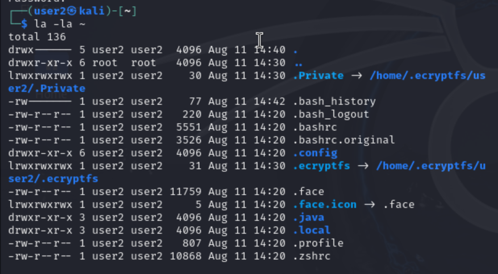
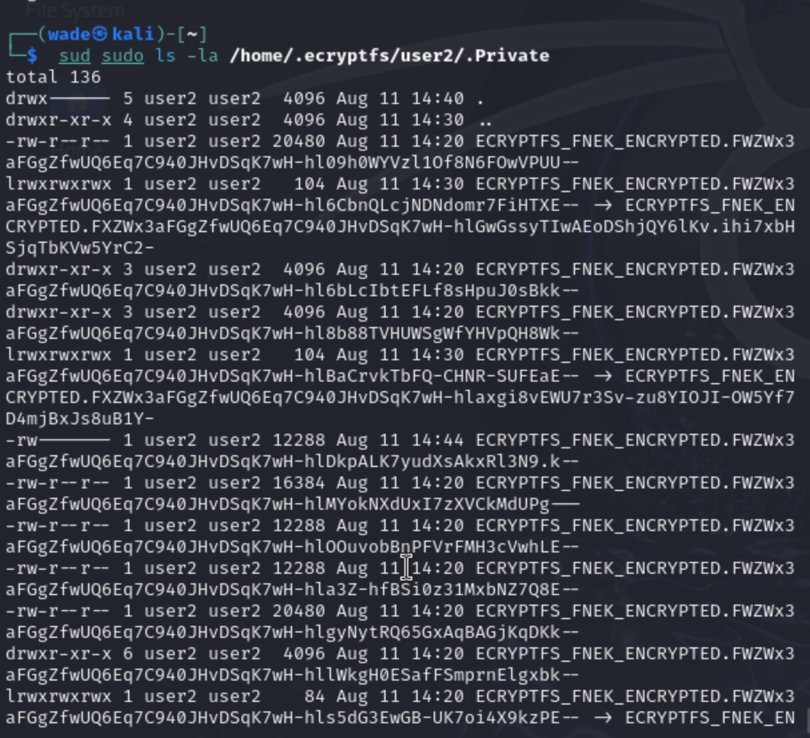
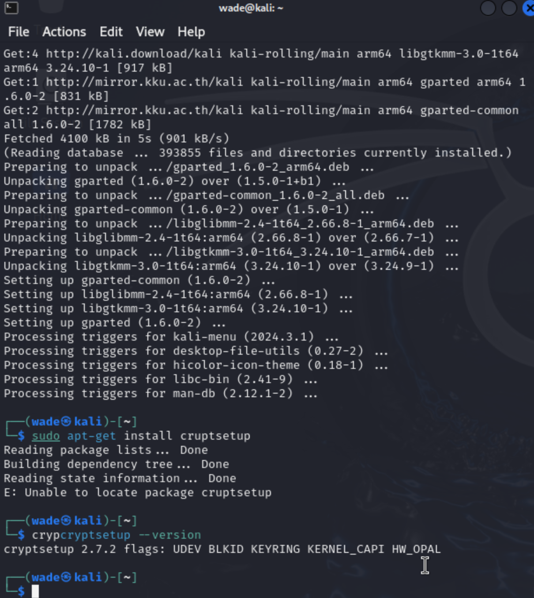
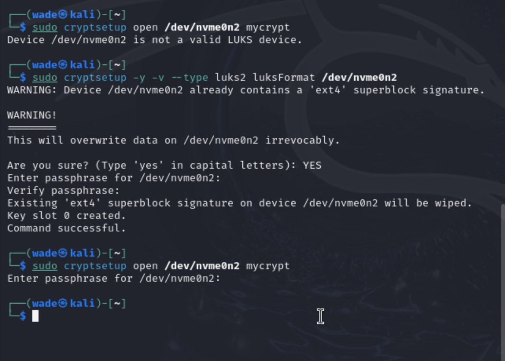
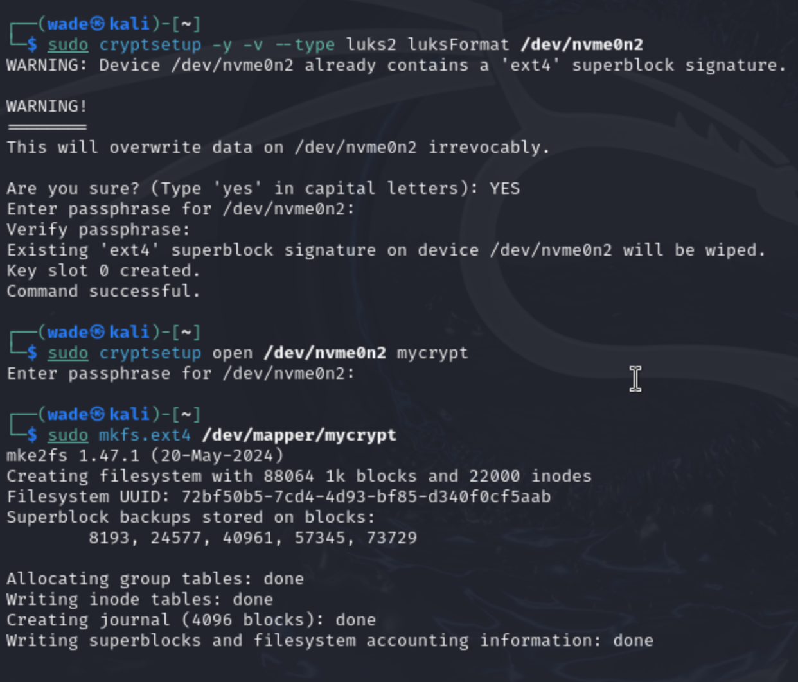
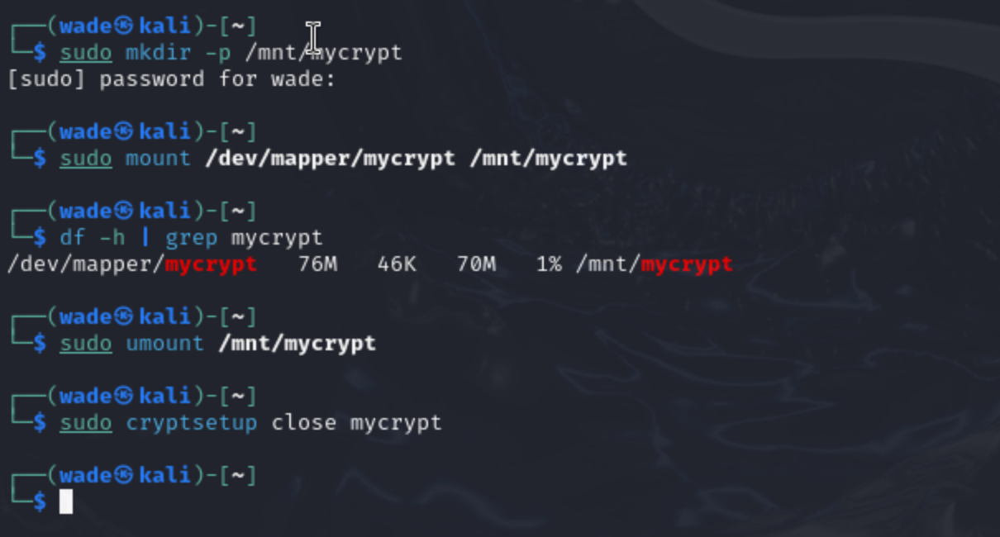

# Домашнее задание к занятию "`Защита хоста`" - `Решетов Павел`

### Задание 1

`Приведите ответ в свободной форме........`

1. `Установите eCryptfs.`
2. `Добавьте пользователя cryptouser.`
3. `Зашифруйте домашний каталог пользователя с помощью eCryptfs.`

`При необходимости прикрепитe сюда скриншоты`

---

### Задание 2

`Приведите ответ в свободной форме........`

1. `Установите поддержку LUKS.`
2. `Создайте небольшой раздел, например, 100 Мб.`
3. `Зашифруйте созданный раздел с помощью LUKS.`

`При необходимости прикрепитe сюда скриншоты`

---

